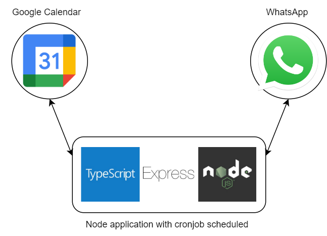

[< Back](../../README.md)

## Ctes F5 ⚽🏟️

Node bot for automatic whatsapp messaging.

## Stack used 💻

### Development

- Node
- Express
- Typescript

### Operations

- Docker and Docker-Compose
- Bat Scripting
- Bash Scripting

## Features ⚙️

- Google Calendar API integration
- WhatsApp-Web js for messaging
- Cronjobs with Node-cron

## Images 📷

