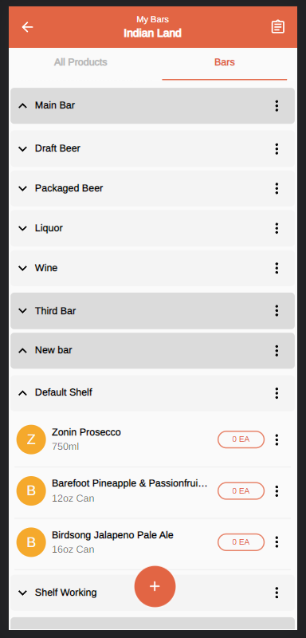
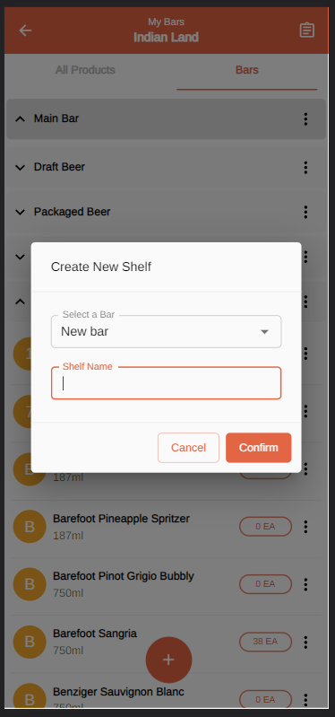
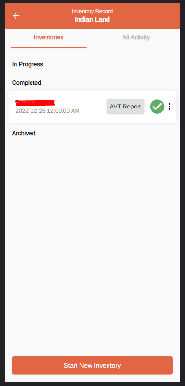

[< Back](../../../README.md)

## BeerBoard - Manual Inventory 🍺🍻

PWA for bars inventory.

## Stack used 💻

### Operations

- Docker and Docker-Compose
- Nginx Web Server/Reverse Proxy
- Let's Encrypt Certbot
- Bash Scripting
- SonarQube code analysis

### Development

- Typescript
- React
- RTK-Query
- Material-UI

## Images 📷

