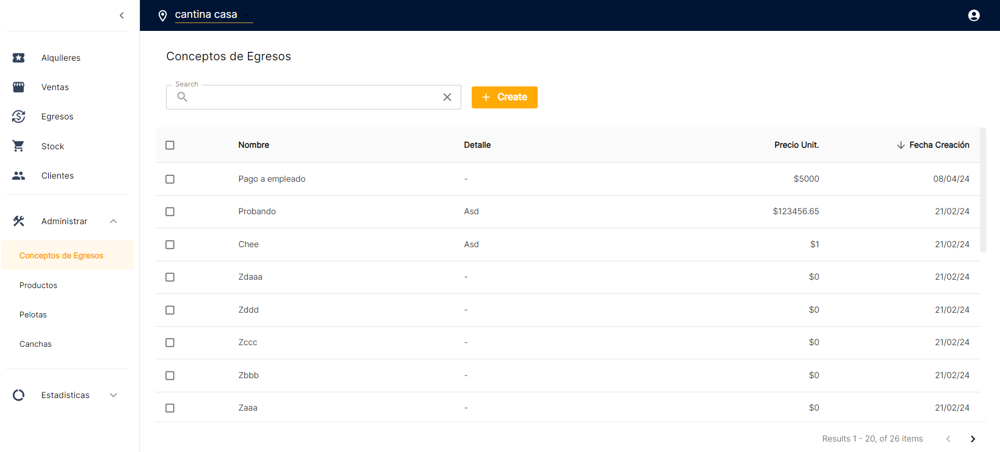
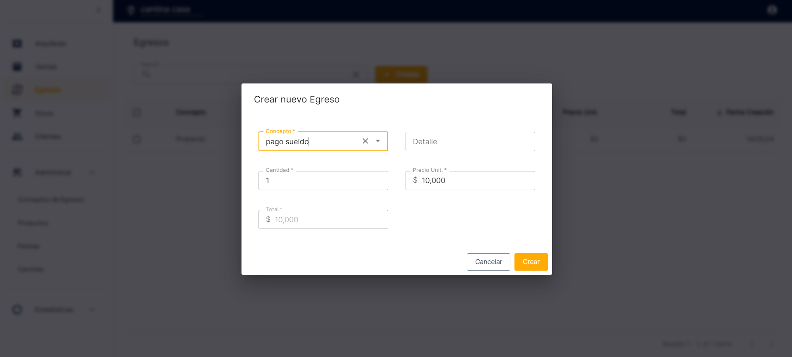

[< Back](../../../README.md)

## Corrientes Futbol 5 App 🥅⚽🏃‍♂️🏟️🏆

### ⚠️ (WIP)

Application for the management of Five-a-side football field rentals and sales.

## Stack used 💻

### Operations

- Docker 🐳
- Docker-Compose
- Nginx Web Server/Reverse Proxy
- Let's Encrypt Certbot
- Ubuntu Server VPC
- Bash Scripting
- Crontab and [Gdrive](https://github.com/prasmussen/gdrive) for automatic DB backup
- CloudFlare
- SonarQube code analysis

### Development

- Go language
- Pocketbase
- Typescript
- React
- RTK-Query
- Material-UI

### Database

- SQLite

## Images 📷

