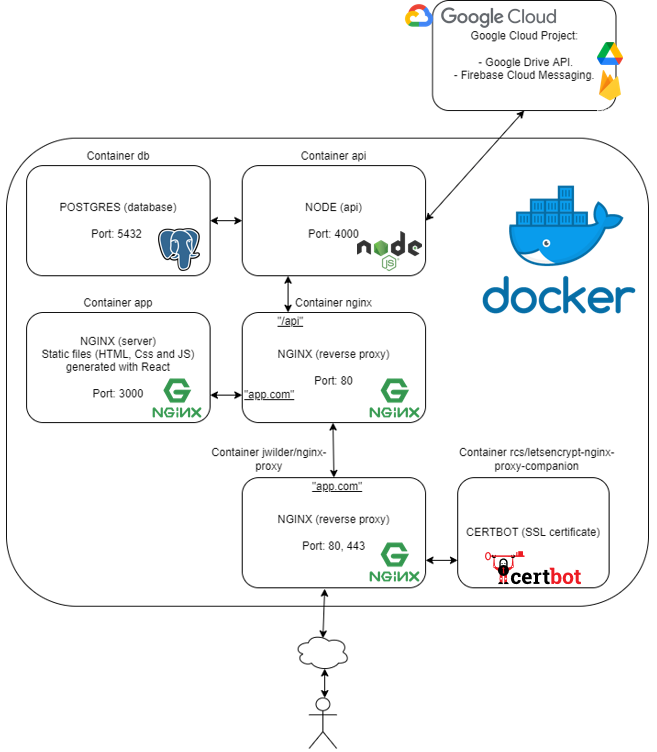
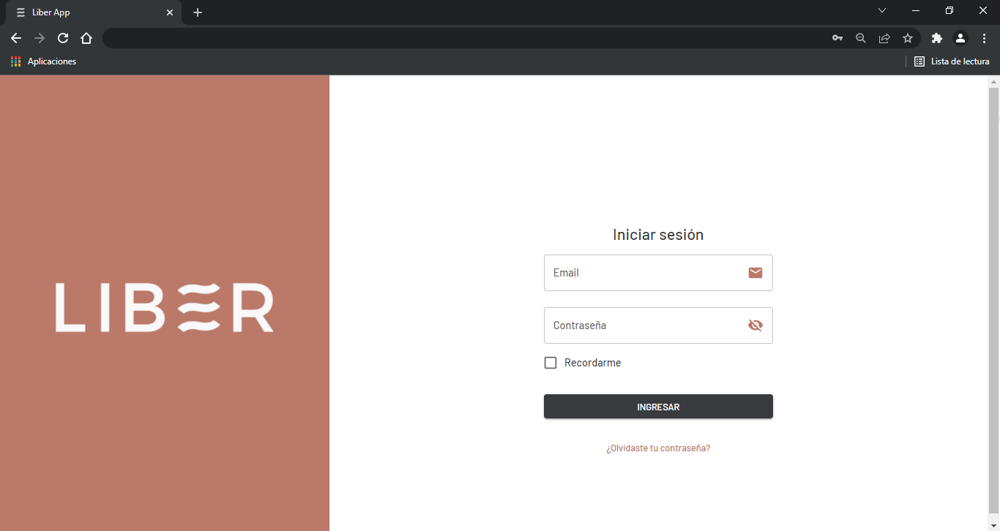
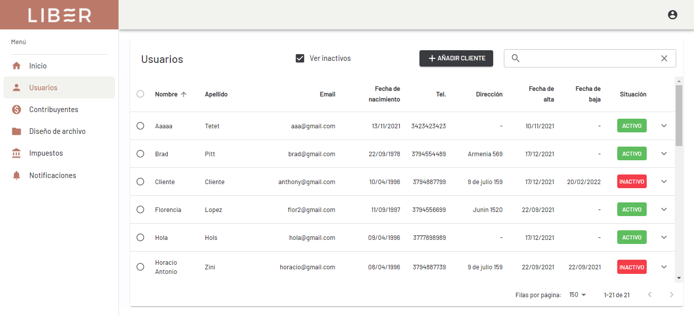
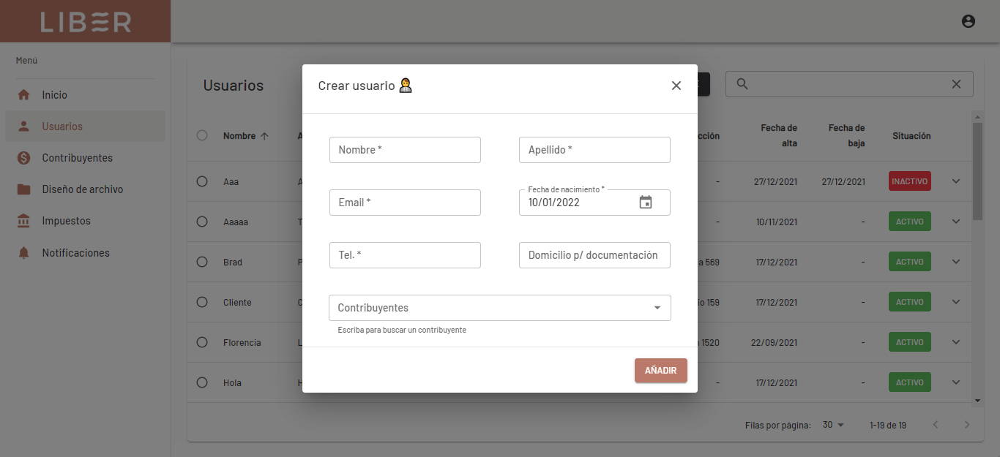
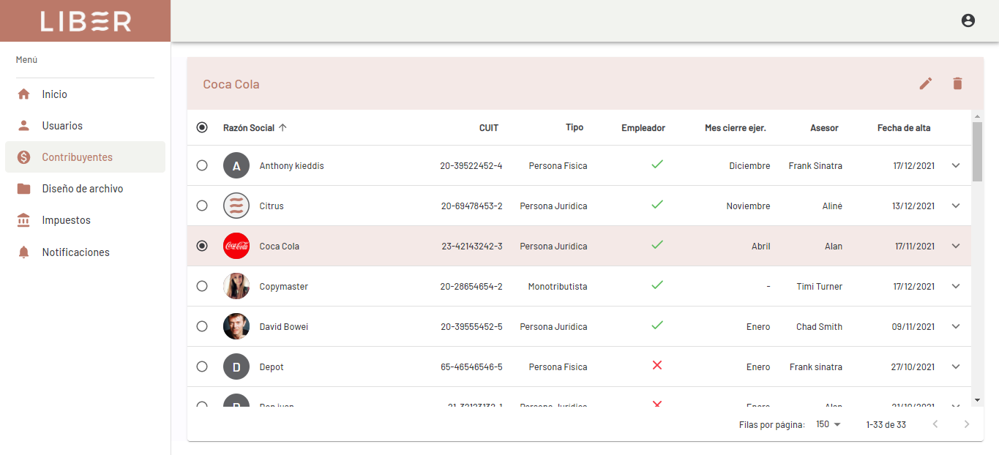
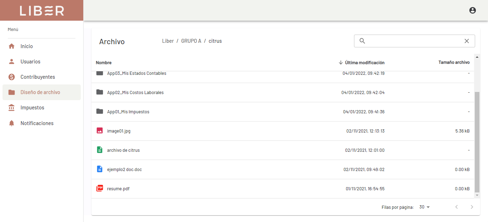
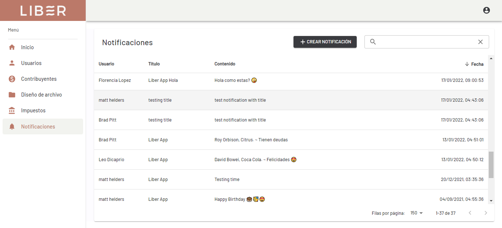

[< Back](../../README.md)

## Liber App 👨‍💼💼

WebApp for accounting study.

## Stack used 💻

### Operations

- Docker 🐳
- Docker-Compose
- Nginx Web Server/Reverse Proxy
- Let's Encrypt Certbot
- Ubuntu Linux VPC
- Bash Scripting
- Crontab and [Gdrive](https://github.com/prasmussen/gdrive) for automatic DB backup
- Jenkins CI/CD
- CloudFlare
- GoogleCloud
- SonarQube code analysis

### Development

- Node
- Express
- Typescript
- React
- Redux-Toolkit
- Material-UI

### Database

- PostgreSQL
- PL/PgSQL

## Some features ⚙️

- Google Drive integration with Google Drive Api
- Push Notifications with Firebase Cloud Messaging
- ETL (extraction, transformation and loading) with SheetJS
- Mailing with Nodemailer
- Cronjobs with Node-cron
- Authentication with Passport JWT
- Feature Flags implementation

## Images 📷

