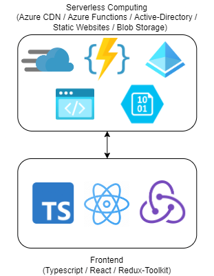
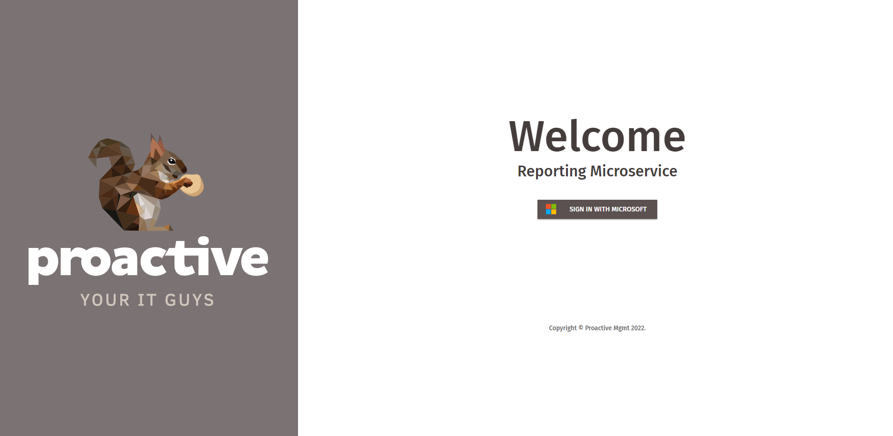
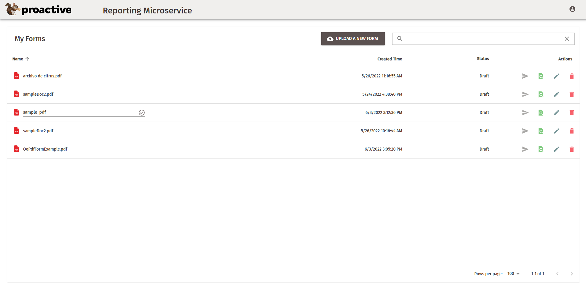
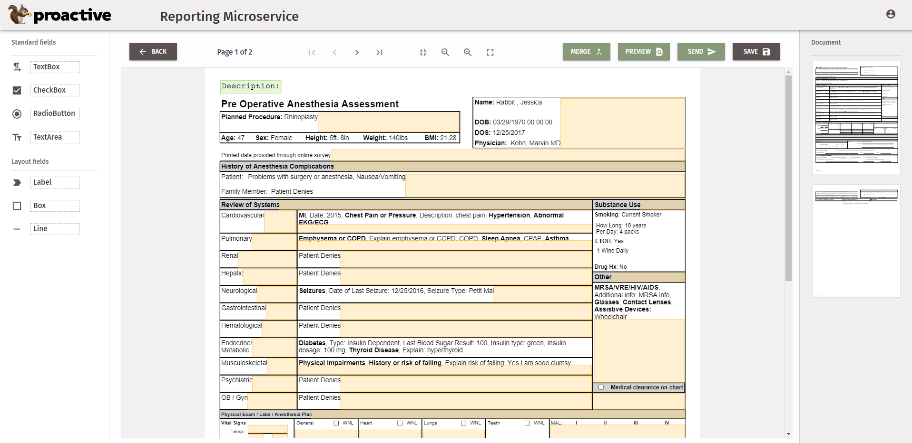

[< Back](../../../README.md)

## Nutty App

### ⚠️ (WIP)

 
Reporting Microservice. PDF Form editing app.

 

## Stack used 💻

### Operations

### QA env:

- Docker 🐳
- Docker-Compose
- GitLab CI/CD
- Bash Scripting
- Nginx Web Server
- Let's Encrypt Certbot
- Ubuntu Linux VPC
- SonarQube code analysis

### Prod env:

- Azure Serverless Computing

### Development

- Typescript
- React
- Redux-Toolkit
- Material-UI

## Images 📷

